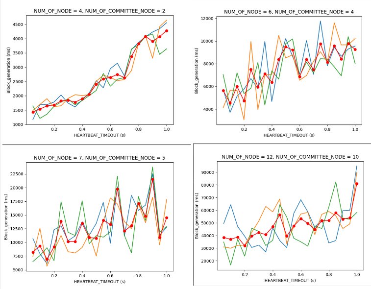

# Proof of training Quality implementation

Basically, this is my implementation for Proof of training Quality consensus machanism from the article [Blockchain and Federated Learning for Privacy-Preserved Data Sharing in Industrial IoT](https://ieeexplore.ieee.org/abstract/document/8843900).

[Read more about my implementation (vi)](./PoQ.pdf)

# Development

### Setup:

```
npm install
```
```
npm run node1
```
```
npm run node2
```

or

```
npm install
```
```
CATEGORY='chicken' SECRET='NODE1' HTTP_PORT=3000 P2P_PORT=5000 node app.js
```
```
CATEGORY='tiger' SECRET='NODE2' HTTP_PORT=3001 P2P_PORT=5001 PEERS='ws://localhost:5000' node app.js
```

_Note that you can change CATEGORY and SECRET but you need to modify the config.js, too._

**Then you can use Postman, call REST APIs to interact with the chain at any entry point.**

E.g:
```curl
GET: localhost:3000/blockchain

POST: localhost:3001/request
{
    "requestModel": 15,
    "requestCategory": "chicken"
}
```

### Create a new node

E.g:

```
CATEGORY='lion' SECRET='your_secret_key' HTTP_PORT=3002 P2P_PORT=5002 PEERS='ws://localhost:5000' node app.js
```

Now you have to call REST API to register.

```
POST: localhost:3002/register
{
    "signature": "third party signature, denotes that you have permission to access"
}
```

_Note that PEERS can't be empty. They are alive p2p servers so you have to set at least $1$ value._


# Production

We will create a Docker image that hosts our code.

```
docker build -t poq:1.0 .
```

Everytime we want to create a new node, just run a container from that image with customized ENV.

E.g:

```
docker run -it poq:1.0 /bin/bash
```
```
CATEGORY='lion' SECRET='NODE3' HTTP_PORT=3000 P2P_PORT=5000 PEERS='ws://172.20.128.1:5000' node app.js
```

_Like I said before, PEERS can't be empty, exept it is the first node._

# Simulation

I use docker-compose to setup a base network with $2$ containers. They 're running at $172.20.128.1$ and $172.20.128.2$. The default ports are $3000$ (REST API) and $5000$ (P2P). To activate, run this command:

```
docker-compose up
```

To create a new node, It 's a little bit different from Production:

```
docker run --network proof-of-training-quality_poq-net --ip 172.20.128.3 -it poq:1.0 /bin/bash
```

_Make sure network is the same as docker-compose by running:_

```
docker network ls
```

_--ip 172.20.128.3 means we set a static ip. Note that network subnet is 172.20.0.0/16, you can check docker-compose.yaml for more details._

Then:
```
CATEGORY='lion' SECRET='NODE3' HTTP_PORT=3000 P2P_PORT=5000 PEERS='ws://172.20.128.1:5000' node app.js
```

## Future works

[Read more about my implementation (vi)](./PoQ.pdf)

## Metrics



## Simple chain

```JSON
[
    {
        "timeStamp": "010101010101",
        "msgType": "GenesisBlock",
        "publicKey": "Hieu Vo",
        "other": {
            "registerPublicKey": "d0233e2fbc91aeb97d462d71b05b6522a01c838249fb93b0ac57bb6965062cb4"
        },
        "transaction": {
            "messages": [
                {
                    "publicKey": "5864f1e7d7e37e95882b398c21ca29b314ebfc6ea1286c8dc1201214cc0d0686",
                    "category": "chicken",
                    "msgType": "DataRetrieval"
                },
                {
                    "publicKey": "276ab32fb62ccc18fcb9c0e792092b9b6911e53b75f951211b232cf84de061bf",
                    "category": "tiger",
                    "msgType": "DataRetrieval"
                }
            ]
        },
        "hash": "0xDEADBEEF",
        "signature": "VH"
    },
    {
        "timeStamp": 1661795140370,
        "msgType": "BlockCommit",
        "publicKey": "5864f1e7d7e37e95882b398c21ca29b314ebfc6ea1286c8dc1201214cc0d0686",
        "category": "chicken",
        "transaction": {
            "messages": [
                {
                    "timeStamp": 1661795121061,
                    "msgType": "DataRetrieval",
                    "publicKey": "57072510e8e9c406943c8ffa69a134f2ce1572290056c57e2fe37ca44044faa9",
                    "category": "lion",
                    "accessSignature": "72D44F1D0117225EBFB324E0CBAE784589E09A84F468A7B601F8E9961237BF40DD270A7F6DDE838644271F8CE594CAC01ADB8A3BFEBC7D0D150C54C762E63C02",
                    "hash": "989bff96baf6f1b9ca5c69129fcf33dd7eeecadb6a04bdb86ef5df14579e7ae5",
                    "signature": "40D08230C0185E445CA001241A2BE7024B55881B1AAB3906751B6BEF86ED4907489E59251D3BA3BB7A627A9D44209E488864DDF1392BDEE35D1D071AAAC4520E"
                },
                {
                    "timeStamp": 1661795132241,
                    "msgType": "DataSharingRequest",
                    "publicKey": "276ab32fb62ccc18fcb9c0e792092b9b6911e53b75f951211b232cf84de061bf",
                    "category": "tiger",
                    "requestCategory": "chicken",
                    "requestModel": 17,
                    "flRound": 1,
                    "hash": "7301c6c30a74ab39f2107d645cded9b4cc8321a33b37a4d2d76cfdc2af762ed6",
                    "signature": "486A7901212496367B9910DC84F92AF8865097C373AC4985AB8D1F4FF27FAD98CE11023DA49A7F5D805CD0217CA91D420F80EC3D6836DAC332CCEA5069634700"
                },
                {
                    "timeStamp": 1661795132241,
                    "msgType": "DataSharingResponse",
                    "publicKey": "5864f1e7d7e37e95882b398c21ca29b314ebfc6ea1286c8dc1201214cc0d0686",
                    "category": "chicken",
                    "model": {
                        "content": "empty"
                    },
                    "MAE": 33.94719487569671,
                    "dataSharingReq": {
                        "timeStamp": 1661795132241,
                        "msgType": "DataSharingRequest",
                        "publicKey": "276ab32fb62ccc18fcb9c0e792092b9b6911e53b75f951211b232cf84de061bf",
                        "category": "tiger",
                        "requestCategory": "chicken",
                        "requestModel": 17,
                        "flRound": 1,
                        "hash": "7301c6c30a74ab39f2107d645cded9b4cc8321a33b37a4d2d76cfdc2af762ed6",
                        "signature": "486A7901212496367B9910DC84F92AF8865097C373AC4985AB8D1F4FF27FAD98CE11023DA49A7F5D805CD0217CA91D420F80EC3D6836DAC332CCEA5069634700"
                    },
                    "hash": "5529342f88febcd980fca461b34ff8a4c8c2799553798d579da1bd09677e6fbf",
                    "signature": "E8B68AE8FB0BB689A67AF91E849432F92FCCFF543519306839D9625B20C5ECDA7ABFDF62EB7956CF24D5C0D1CC361998D5C559C9DE48E2ABFC2FD5161DE08908"
                }
            ]
        },
        "preHash": "0xDEADBEEF",
        "aggregatedModel": {},
        "committeeSignatures": [
            {
                "publicKey": "5864f1e7d7e37e95882b398c21ca29b314ebfc6ea1286c8dc1201214cc0d0686",
                "signature": "75BE1C29F744BBD90B926888A7B6D144DE6973BD6699C7E173B633350BFD41728E5826EC0A2BF26A5327021A2B04124C63A86DAE938B70611DA2055351BDEB04"
            }
        ],
        "hash": "d525f7379300522abfca8be426fc631b64563f73c329b6ae30ee64c11498c209",
        "signature": "5D514684F51250FEBF458D8CB6DBB94D4261B730F36B1FDA9D770BAC66491E4E60D3C3011CA22BF5398547C3C8F19F8AAABC755761B9F9A64006A10031EC9C00"
    },
    {
        "timeStamp": 1661795152927,
        "msgType": "BlockCommit",
        "publicKey": "5864f1e7d7e37e95882b398c21ca29b314ebfc6ea1286c8dc1201214cc0d0686",
        "category": "chicken",
        "transaction": {
            "messages": [
                {
                    "timeStamp": 1661795144785,
                    "msgType": "DataSharingRequest",
                    "publicKey": "276ab32fb62ccc18fcb9c0e792092b9b6911e53b75f951211b232cf84de061bf",
                    "category": "tiger",
                    "requestCategory": "chicken",
                    "requestModel": {},
                    "flRound": 2,
                    "hash": "a679dcba66f30f2a369db137fc8efb736698da0460b554f2968ed72865abd77e",
                    "signature": "B3A01090AF23FC547DA72B92621E786D9EB506CFC70BF77BC799F874E27D378B25D67AD512E88BEFF8D183DD8DEBBA81DD115437DB8904FBF55FF293809DA909"
                },
                {
                    "timeStamp": 1661795144785,
                    "msgType": "DataSharingResponse",
                    "publicKey": "5864f1e7d7e37e95882b398c21ca29b314ebfc6ea1286c8dc1201214cc0d0686",
                    "category": "chicken",
                    "model": {
                        "content": "empty"
                    },
                    "MAE": 38.94360916336525,
                    "dataSharingReq": {
                        "timeStamp": 1661795144785,
                        "msgType": "DataSharingRequest",
                        "publicKey": "276ab32fb62ccc18fcb9c0e792092b9b6911e53b75f951211b232cf84de061bf",
                        "category": "tiger",
                        "requestCategory": "chicken",
                        "requestModel": {},
                        "flRound": 2,
                        "hash": "a679dcba66f30f2a369db137fc8efb736698da0460b554f2968ed72865abd77e",
                        "signature": "B3A01090AF23FC547DA72B92621E786D9EB506CFC70BF77BC799F874E27D378B25D67AD512E88BEFF8D183DD8DEBBA81DD115437DB8904FBF55FF293809DA909"
                    },
                    "hash": "fcc3442627dc06881c1e476dfd24d5a24c3bdc7726a95aff427cb98aa9752b42",
                    "signature": "19BD1BB57C7FE66E14FB77FD5BECE16D3E32E820765682214E747D94FB6AC6AF44526BC349B8859CFAC8B5173BE71884CED2A3516D18AC476760D1370F0C0F0E"
                }
            ]
        },
        "preHash": "d525f7379300522abfca8be426fc631b64563f73c329b6ae30ee64c11498c209",
        "aggregatedModel": {},
        "committeeSignatures": [
            {
                "publicKey": "5864f1e7d7e37e95882b398c21ca29b314ebfc6ea1286c8dc1201214cc0d0686",
                "signature": "75B3AF157056BBDDCC0933284FF2050AB0D7A8191276FCC3A2BAC48A5E9E4A62F29433671FFA00879400DB14ABCFAB79BD8CF096F0BBA5520D463C88938F9504"
            }
        ],
        "hash": "32c8df59c5cd6f54d122bacf35910606c4a78529cc13be981f1b1cc7d5829e07",
        "signature": "D682D8FD8BD652994872FECD073A09E0492988F8DC386D6D591BE39D92DF3324E0AA49AED329883BD6FDF90A5BBFE251AF6537789BBC007245A696CE361C7201"
    },
    {
        "timeStamp": 1661795165381,
        "msgType": "BlockCommit",
        "publicKey": "5864f1e7d7e37e95882b398c21ca29b314ebfc6ea1286c8dc1201214cc0d0686",
        "category": "chicken",
        "transaction": {
            "messages": [
                {
                    "timeStamp": 1661795157259,
                    "msgType": "DataSharingRequest",
                    "publicKey": "276ab32fb62ccc18fcb9c0e792092b9b6911e53b75f951211b232cf84de061bf",
                    "category": "tiger",
                    "requestCategory": "chicken",
                    "requestModel": {},
                    "flRound": 3,
                    "hash": "6357f30cb1c275155291c60a10cebd2823947f6e1b5217480dd7d54eee75cbe5",
                    "signature": "A2B932B8391BA77A90F1B3F2011BCB1833388060903C7932D4E29AC14F826AD0ABC7D16069F4563AF8810944CD277113DF4B3C9CD51D15BA8FD29CE5EA8F4500"
                },
                {
                    "timeStamp": 1661795157259,
                    "msgType": "DataSharingResponse",
                    "publicKey": "5864f1e7d7e37e95882b398c21ca29b314ebfc6ea1286c8dc1201214cc0d0686",
                    "category": "chicken",
                    "model": {
                        "content": "empty"
                    },
                    "MAE": 0.838031966233288,
                    "dataSharingReq": {
                        "timeStamp": 1661795157259,
                        "msgType": "DataSharingRequest",
                        "publicKey": "276ab32fb62ccc18fcb9c0e792092b9b6911e53b75f951211b232cf84de061bf",
                        "category": "tiger",
                        "requestCategory": "chicken",
                        "requestModel": {},
                        "flRound": 3,
                        "hash": "6357f30cb1c275155291c60a10cebd2823947f6e1b5217480dd7d54eee75cbe5",
                        "signature": "A2B932B8391BA77A90F1B3F2011BCB1833388060903C7932D4E29AC14F826AD0ABC7D16069F4563AF8810944CD277113DF4B3C9CD51D15BA8FD29CE5EA8F4500"
                    },
                    "hash": "22b66c015864cf2cb3e7b456904083a3180fcd54e84deba35669c99dc6f8b4bb",
                    "signature": "BBECE49F091E0DDE72C0B07B0EEC651A90F5DFE505B80FA6FD7664A6605F8CCF2EC4CC9AE09F98DA82214B741D5F916C7651F11D68A4F2D93E5BE33554685000"
                }
            ]
        },
        "preHash": "32c8df59c5cd6f54d122bacf35910606c4a78529cc13be981f1b1cc7d5829e07",
        "aggregatedModel": {},
        "committeeSignatures": [
            {
                "publicKey": "5864f1e7d7e37e95882b398c21ca29b314ebfc6ea1286c8dc1201214cc0d0686",
                "signature": "E1974CDCC6AAEF4D7DAB1741779DA86926299666F0F406B8566B98825250A61E3BE0AFCD08747BC86C7F99D9E7138862F454F7E93F9B8206F79DABA97F3A450D"
            }
        ],
        "hash": "a2ad6e0a375ffbaa8decb3aeb048ffe21314333e51eee322b0886034f898f5db",
        "signature": "7B701136BAEB6213A274C36511937BABCD81AE1317B89BE6BCAB43BDB1A67F544BEDA39E42FC0B70D8D30442F09F0C43DF7404108F1636B138166C9837FD9409"
    },
    {
        "timeStamp": 1661795177761,
        "msgType": "BlockCommit",
        "publicKey": "5864f1e7d7e37e95882b398c21ca29b314ebfc6ea1286c8dc1201214cc0d0686",
        "category": "chicken",
        "transaction": {
            "messages": [
                {
                    "timeStamp": 1661795169650,
                    "msgType": "DataSharingRequest",
                    "publicKey": "276ab32fb62ccc18fcb9c0e792092b9b6911e53b75f951211b232cf84de061bf",
                    "category": "tiger",
                    "requestCategory": "chicken",
                    "requestModel": {},
                    "flRound": 4,
                    "hash": "ccfb980637087d4ce03f42de17802d2d1387e2fe9fa5e31be972c549a3dae75d",
                    "signature": "3FE210433639C88F6338F8CFFB2CAF712095931CFC5B1D9CD82DCB7EB36F112A33B847FA24C094776114C8037C8EBD075033A7924B68F43235857B7CD1756D02"
                },
                {
                    "timeStamp": 1661795169650,
                    "msgType": "DataSharingResponse",
                    "publicKey": "5864f1e7d7e37e95882b398c21ca29b314ebfc6ea1286c8dc1201214cc0d0686",
                    "category": "chicken",
                    "model": {
                        "content": "empty"
                    },
                    "MAE": 87.52321608338092,
                    "dataSharingReq": {
                        "timeStamp": 1661795169650,
                        "msgType": "DataSharingRequest",
                        "publicKey": "276ab32fb62ccc18fcb9c0e792092b9b6911e53b75f951211b232cf84de061bf",
                        "category": "tiger",
                        "requestCategory": "chicken",
                        "requestModel": {},
                        "flRound": 4,
                        "hash": "ccfb980637087d4ce03f42de17802d2d1387e2fe9fa5e31be972c549a3dae75d",
                        "signature": "3FE210433639C88F6338F8CFFB2CAF712095931CFC5B1D9CD82DCB7EB36F112A33B847FA24C094776114C8037C8EBD075033A7924B68F43235857B7CD1756D02"
                    },
                    "hash": "ee3a990330d4855a6520119a321d64306a3326bb1fd55445f872117bde986768",
                    "signature": "7E68C9778C875B676A88B540F035E8E80BA4CF735DD56E759B86B935131F2F7495B9EE8467B26FF7A1CF5281EB0E23919C5995C0D4006E0D9AFD24F78E086A0C"
                }
            ]
        },
        "preHash": "a2ad6e0a375ffbaa8decb3aeb048ffe21314333e51eee322b0886034f898f5db",
        "aggregatedModel": {},
        "committeeSignatures": [
            {
                "publicKey": "5864f1e7d7e37e95882b398c21ca29b314ebfc6ea1286c8dc1201214cc0d0686",
                "signature": "5CB323277E72D0068505BBA70AE496D469409CFBF0966C45E7603C526527DD8564EC51D3AB92EBC6CFD23A81C5972C55C3C041EF604974EF1F67273525D9F400"
            }
        ],
        "hash": "c19a9b0a9e360b2eac24bf33794b1dc65bf3899fb7464d2c0a46b8f70d0db746",
        "signature": "DDC0D2D733AF62C3C41FAAE61F3DD7917045E5582DF584079D17D75208A8C7B973B02FB5763B3241132D554601C85422C26FF81ED8806EC660A52C6FA7B9F605"
    },
    {
        "timeStamp": 1661795190217,
        "msgType": "BlockCommit",
        "publicKey": "5864f1e7d7e37e95882b398c21ca29b314ebfc6ea1286c8dc1201214cc0d0686",
        "category": "chicken",
        "transaction": {
            "messages": [
                {
                    "timeStamp": 1661795182077,
                    "msgType": "DataSharingRequest",
                    "publicKey": "276ab32fb62ccc18fcb9c0e792092b9b6911e53b75f951211b232cf84de061bf",
                    "category": "tiger",
                    "requestCategory": "chicken",
                    "requestModel": {},
                    "flRound": 5,
                    "hash": "18dd82d9e158d464627fe16d3cc6597d16fc003d8115f7991d96eddbb1011d52",
                    "signature": "E256DDB9866BA6C6B735A5DDC696CF42D60D1511A39FFA124C8CEEFB66437C5998F155E2A41FA26F18B43D7FF7CAFB9C81F50F9C24A61F18D00B3C0D2C377509"
                },
                {
                    "timeStamp": 1661795182077,
                    "msgType": "DataSharingResponse",
                    "publicKey": "5864f1e7d7e37e95882b398c21ca29b314ebfc6ea1286c8dc1201214cc0d0686",
                    "category": "chicken",
                    "model": {
                        "content": "empty"
                    },
                    "MAE": 3.4457792979605717,
                    "dataSharingReq": {
                        "timeStamp": 1661795182077,
                        "msgType": "DataSharingRequest",
                        "publicKey": "276ab32fb62ccc18fcb9c0e792092b9b6911e53b75f951211b232cf84de061bf",
                        "category": "tiger",
                        "requestCategory": "chicken",
                        "requestModel": {},
                        "flRound": 5,
                        "hash": "18dd82d9e158d464627fe16d3cc6597d16fc003d8115f7991d96eddbb1011d52",
                        "signature": "E256DDB9866BA6C6B735A5DDC696CF42D60D1511A39FFA124C8CEEFB66437C5998F155E2A41FA26F18B43D7FF7CAFB9C81F50F9C24A61F18D00B3C0D2C377509"
                    },
                    "hash": "e5cff46d46005512017a8b05eff40b64a4f41e47404eea39ef82872dcbd2e2f5",
                    "signature": "5C9CA2522C245C5092FC60B82F41700F4E84CC21949CC1BEF572FD30D704F4966402E32512D3E6820D5C14856B0F461ED48F7C4B32CF0C6765CCB72767561E00"
                }
            ]
        },
        "preHash": "c19a9b0a9e360b2eac24bf33794b1dc65bf3899fb7464d2c0a46b8f70d0db746",
        "aggregatedModel": {},
        "committeeSignatures": [
            {
                "publicKey": "5864f1e7d7e37e95882b398c21ca29b314ebfc6ea1286c8dc1201214cc0d0686",
                "signature": "86EEA9A1910B0BFCBADF0FF92BB8687E11962087CB95783713E7DB5137BE55367E8F1665A82F7C97B11B7D4C1CDAC1B0E7B4F021FF29E24006774621F8514F08"
            }
        ],
        "hash": "646d4bc5779baa6c8358b25c91da19abc9fbcb1e1e9437eec177832abc49faf2",
        "signature": "D3EB866E0FA7FF5FA931F39B4389F811EF58D4DA571779ECBF10FD3EAC9A54D1CF52CE754EAD20CADFFDB61D701FF2EA01D1CF9133DD093F17AFD9A577D54E05"
    }
]
```